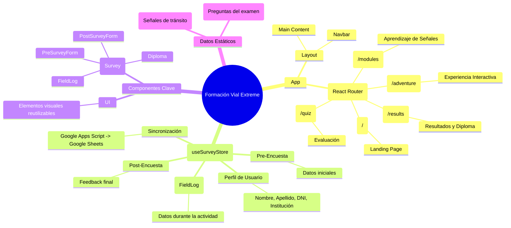

# Mapa Mental de la Aplicación (Arquitectura)

Este documento proporciona una visión general de la estructura y el flujo de datos de la aplicación "Formación Vial Extreme".

## Diagrama de Estructura (Mermaid)

## Descripción de los Módulos

### 1. Navegación y Rutas (`App.tsx`)
La aplicación utiliza `HashRouter` para la navegación, lo que facilita su despliegue en servidores estáticos o entornos locales sin configuración de servidor compleja.
- **Landing (`/`)**: Página de inicio, probablemente contiene la introducción y acceso a los módulos.
- **SenalesModule (`/modules`)**: Módulo educativo para aprender las señales de tránsito.
- **Adventure (`/adventure`)**: El núcleo de la experiencia gamificada o interactiva.
- **Quiz (`/quiz`)**: Evaluación de conocimientos adquiridos.
- **Results (`/results`)**: Muestra el puntaje final y genera el diploma.

### 2. Gestión de Estado (`useSurveyStore.ts`)
El "cerebro" de la aplicación es el `useSurveyStore`. Maneja toda la información del usuario a través de la sesión:
- **Persistencia**: Guarda datos en `localStorage` con la clave `vial_survey_data` para que no se pierdan al recargar.
- **Flujo de Datos**:
    1.  **Perfil**: Se captura al inicio.
    2.  **Pre-Encuesta**: Se completa antes de la actividad.
    3.  **Field Data**: Se recopila durante la "Aventura".
    4.  **Post-Encuesta**: Se completa al final.
    5.  **Sincronización**: Envía todos los datos a un Google Sheet mediante un Google Apps Script.

### 3. Componentes Principales (`src/components`)
- **Layout**: Estructura base que envuelve a las páginas (mantiene la barra de navegación visible).
- **Survey**: Contiene los formularios específicos para cada etapa de la recolección de datos (`PreSurveyForm`, `PostSurveyForm`, `FieldLog`).
- **Diploma**: Componente para visualizar y generar el certificado de finalización.

### 4. Datos (`src/data`)
- **signs.ts**: Contiene la información estática de las señales de tránsito (imágenes, descripciones).
- **quiz.ts**: Contiene las preguntas y respuestas para el módulo de evaluación.

## Flujo de Usuario Típico

1.  Usuario entra a la **Landing**.
2.  Completa sus datos y la **Pre-Encuesta**.
3.  Navega a **SenalesModule** para aprender.
4.  Participa en la **Adventure** (registrando datos en `FieldLog`).
5.  Realiza el **Quiz**.
6.  Ve sus **Resultados**, completa la **Post-Encuesta** y descarga su **Diploma**.
7.  Los datos se sincronizan automáticamente con la nube.
